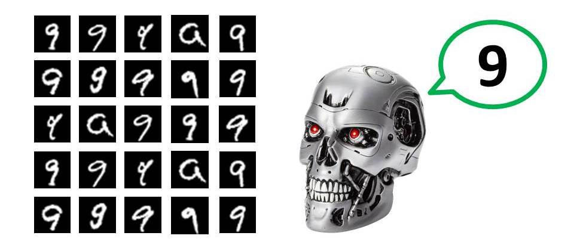
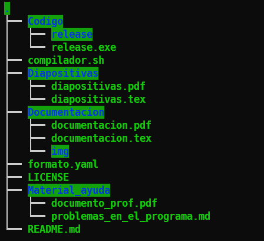
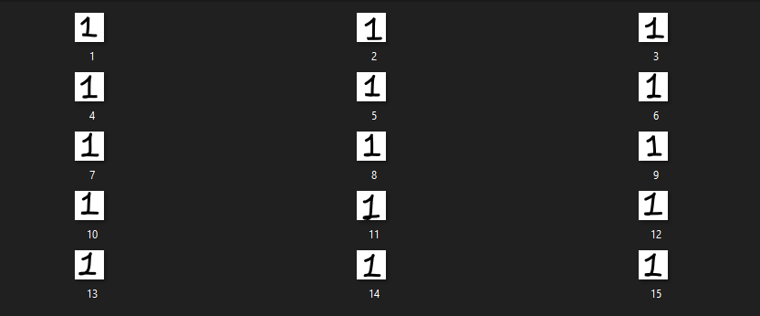

```yaml
Campus: Ciudad Universitaria
Facultad: Ingeniería
Materia : Inteligencia Artificial
Semestre: 2022-2
Equipo: 1
Clave: 0406
Participantes: 
- Barrera Peña Víctor Miguel
- Espino De Horta Joaquín Gustavo
	
Profesor: Dr. Ismael Everardo Barcenas Patiño
Título : Proyecto 4
Subtítulo : Clasificador de imagenes
Fecha entrega: 26/05/2022

```

{ width=110% }

\pagebreak

# Capítulo 0 Estructura del  repositorio



# Capítulo 1 Introducción

La clasificación de imágenes es un concepto bastante viejo, aunque no pareciese así, digamos que tiene entre 50 y 60  (1960-1970) años la primera vez que se utilizó una tecnología así, sólo que esa vez era más primitiva, por varias razones, tenemos que pensar que en ese tiempo las computadoras, todavía trabajaban con grandes computadoras que ocupaban un cuarto, todavía no estaba la teoría para la creación

Pero ¿Qué era lo que realmente realizaba? La clasificación entre hombres y mujeres. ¿Cómo lo realizaba? Primero quiero que te imágenes señoritas vestidas con pelo más abultado que el de los caballeros, sólo se usaba foto de los hombros hacia arriba, se usaban sensores sensibles a la luz, para poder pasar fotografías analógicas a digital, posterior a ello este daba un mensaje diciendo si era hombre o mujer, es un excelente antecedente de clasificación de imágenes.

Empezamos con el siguiente investigador que se acerca más a lo que es mi proyecto, ya que el uso celdas foto sensibles para pasar trazos a letras, esto es para digitalizarlos, pero además le enseño a hablar, es decir  pronunciar las palabras en el lenguaje inglés, resumiendo esto, el hizo una clasificación de letras y además una red neural para que pudieran hablar.


{ width=30% }


Retomando lo hecho por los antes mencionados, implementó, pero ahora usando computadoras modernas, y con mucha mayor potencia, que aquellos tiempos, y ahora todo siendo digital, mediante lenguajes de programación y probabilidad, en lugar de redes neuronales como en 1986.

# Definición del problema

En el proyecto anterior se tenía que utilizar el teorema de Bayes para poder calcular la probabilidad y con dicho programa vamos a partir, es decir que los conceptos asociados al calculo de probabilidades mediante Bayes, ya se pueden calcular.

Definimos una imagen de $X,Y$ dimensiones  dadas en `pixeles`, cada pixel tiene 3 canales de color RGB con los cuales podemos modificar. Cada imagen tendrá que ser clasificada dentro de una de las posibles opciones de los datos entrenados, suponga que existen $C=[c_1,c_2,c_3, \cdots,c_n]$ clasificaciones con las que fue entrenado, la imagen se pasará por el programa y dirá $c_j$ es la clasificación más probable o más parecida.

Vamos a definir la entrada, que en realidad son dos diferentes entradas, por una parte tenemos al data-set para entrenar a nuestro modelo, piense que tenemos una imagen de $X,Y$ dimensiones y el otro imágenes que tendremos que hacer pruebas, pero a diferencia de  el set que esta contenido en dimensiones especificas y con colores especificos, las imagenes con las que se tienen que clasificar, no cuentan con dichas características.

En este caso $C=[0,1,2, \cdots,9]$​. Nuestro objetivo es detectar el número [0-9] por tanto, cada símbolo de este conjunto  tiene que tener un conjunto de imagenes que compartan una tendencia, por ejemplo tener 100 imágenes de el número 1 desde diferentes posiciones y rotaciones, con ello mediante expresiones matemáticas intentaremos modelar un comportamiento que prediga el conjunto de datos abstrayendo lo más importante.

En el caso de este proyecto se ha delimitado a que las imágenes de entrenamiento tengan un  dimensión de $X,Y$ de $32,32$ . Esto tiene la razón de para limitar el tiempo de procesamiento de entrenamiento, además de que el peso del repositorio no se eleve mucho.  La recomendación viene dada de un data-set real que tenia para reconocimiento de letras que tenia un peso de $1[Gb]$ y con ello contaba con al rededor de **307,200** imagenes de entrenamiento.

Recordando que en este caso que dado un vector de condiciones $\vec{Q}$ que contiene los valores $[q_1,q_2,...,q_j]$ para $j$ condiciones, a los cuales debe igualarse $Am_i$, obtener $Y_{max}(\vec{Q})$ que es la probabilidad más grande para dicho vector.

# Solución

## Teoría

### Primer paso , elaboración de data-set

En este caso son 10 conjuntos de imágenes, cada uno con 15 imágenes como se aprecia en este caso para $C_1=1$

 

### Segundo paso,  elaboración de historiagrama

Para este método de predicción tenemos que que tomar $32 \hspace{0.3cm}x \hspace{0.3cm} 32=1024$ .Será un histograma que contiene el número que que tan negro es, si este es 0 significa que lo es, sin embargo si es 255 es blanco, si es un intermedio entre estos es un gris. Sólo tenemos esos dos, ya que limitamos nuestra entrada a dichos dos colores, para simplificar, si una entrada fuera de otro color tendríamos que cambiarla a grises, ya que los que nos interesa en esta clasificación es la forma, no el color.

Para la creación del histograma, el  programa lo hace en automático como se ve en la siguiente ejecución 


Cabe aclarar que el programa en automático puede entrenarse para otro conjunto $C$ , lo único que necesita es llamar a las carpetas como el nombre de los elementos $c_n$, véase que en el caso de el conjunto de las pru


,	

## 


Para la solución requerimos de dos cosas:

- Teorema de Bayes implementado
- Un data-set de 

## Pseudocódigo

## Explicación

# Experimentos

## Baja dificultad

### Problema 1

### Problema 2

### Problema 3

## Media dificultad

### Problema 1

### Problema 2

### Problema 3

## Alta dificultad

### Problema 1

### Problema 2

### Problema 3

## Sin solución

# Capítulo 1  Introducción 


# Capítulo 2 Desarrollo

## Idea de desarrollo del programa

## Casos de prueba

### Triviales (1 caso)

### Fáciles (3 casos)

### Media (3 casos)

### Difíciles ( 3 casos )

### Sin solución (1 caso)

### Código

## Explicación código

# Capítulo 3 Conclusión

## Barrera Peña Víctor Miguel

## Espino de Horta Joaquín Gustavo


# Anexo (teoría)

# Referencias

- *The evolution of image classification explained*. (z.d.). Image Classification. Geraadpleegd op 6 mei 2022, van https://stanford.edu/%7Eshervine/blog/evolution-image-classification-explained
- G. (2021, 14 mei). *A brief history of Facial Recognition*. NEC. Geraadpleegd op 6 mei 2022, van https://www.nec.co.nz/market-leadership/publications-media/a-brief-history-of-facial-recognition/#:%7E:text=The%20earliest%20pioneers%20of%20facial,to%20recognise%20the%20human%20face.
- *History of Artificial Intelligence in hindi | Brief history | MCA/B.tech,etc | ai history*. (2021, 4 oktober). YouTube. Geraadpleegd op 6 mei 2022, van https://www.youtube.com/watch?v=3qRJfUv7W_Y

