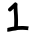

```yaml
Campus: Ciudad Universitaria
Facultad: Ingeniería
Materia : Inteligencia Artificial
Semestre: 2022-2
Equipo: 1
Clave: 0406
Participantes: 
- Barrera Peña Víctor Miguel
- Espino De Horta Joaquín Gustavo
	
Profesor: Dr. Ismael Everardo Barcenas Patiño
Título : Proyecto 4
Subtítulo : Clasificador de imagenes
Fecha entrega: 26/05/2022

```

{ width=110% }

\pagebreak

# Capítulo 0 Estructura del  repositorio


# Capítulo 1 Introducción

La clasificación de imágenes es un concepto bastante viejo, aunque no pareciese así, digamos que tiene entre 50 y 60  (1960-1970) años la primera vez que se utilizó una tecnología así, sólo que esa vez era más primitiva, por varias razones, tenemos que pensar que en ese tiempo las computadoras, todavía trabajaban con grandes computadoras que ocupaban un cuarto, todavía no estaba la teoría para la creación

Pero ¿Qué era lo que realmente realizaba? La clasificación entre hombres y mujeres. ¿Cómo lo realizaba? Primero quiero que te imágenes señoritas vestidas con pelo más abultado que el de los caballeros, sólo se usaba foto de los hombros hacia arriba, se usaban sensores sensibles a la luz, para poder pasar fotografías analógicas a digital, posterior a ello este daba un mensaje diciendo si era hombre o mujer, es un excelente antecedente de clasificación de imágenes.

Empezamos con el siguiente investigador que se acerca más a lo que es mi proyecto, ya que el uso celdas foto sensibles para pasar trazos a letras, esto es para digitalizarlos, pero además le enseño a hablar, es decir  pronunciar las palabras en el lenguaje inglés, resumiendo esto, el hizo una clasificación de letras y además una red neural para que pudieran hablar.


{ width=30% }


Retomando lo hecho por los antes mencionados, implementó, pero ahora usando computadoras modernas, y con mucha mayor potencia, que aquellos tiempos, y ahora todo siendo digital, mediante lenguajes de programación y probabilidad, en lugar de redes neuronales como en 1986.

# Definición del problema

En el proyecto anterior se tenía que utilizar el teorema de Bayes para poder calcular la probabilidad y con dicho programa vamos a partir, es decir que los conceptos asociados al calculo de probabilidades mediante Bayes, ya se pueden calcular.

Definimos una imagen de $X,Y$ dimensiones  dadas en `pixeles`, cada pixel tiene 3 canales de color RGB con los cuales podemos modificar. Cada imagen tendrá que ser clasificada dentro de una de las posibles opciones de los datos entrenados, suponga que existen $C=[c_1,c_2,c_3, \cdots,c_n]$ clasificaciones con las que fue entrenado, la imagen se pasará por el programa y dirá $c_j$ es la clasificación más probable o más parecida.

Vamos a definir la entrada, que en realidad son dos diferentes entradas, por una parte tenemos al data-set para entrenar a nuestro modelo, piense que tenemos una imagen de $X,Y$ dimensiones y el otro imágenes que tendremos que hacer pruebas, pero a diferencia de  el set que esta contenido en dimensiones especificas y con colores especificos, las imagenes con las que se tienen que clasificar, no cuentan con dichas características.

En este caso $C=[0,1,2, \cdots,9]$​. Nuestro objetivo es detectar el número [0-9] por tanto, cada símbolo de este conjunto  tiene que tener un conjunto de imagenes que compartan una tendencia, por ejemplo tener 100 imágenes de el número 1 desde diferentes posiciones y rotaciones, con ello mediante expresiones matemáticas intentaremos modelar un comportamiento que prediga el conjunto de datos abstrayendo lo más importante.

En el caso de este proyecto se ha delimitado a que las imágenes de entrenamiento tengan un  dimensión de $X,Y$ de $32,32$ . Esto tiene la razón de para limitar el tiempo de procesamiento de entrenamiento, además de que el peso del repositorio no se eleve mucho.  La recomendación viene dada de un data-set real que tenia para reconocimiento de letras que tenia un peso de $1[Gb]$ y con ello contaba con al rededor de **307,200** imagenes de entrenamiento.

Recordando que en este caso que dado un vector de condiciones $\vec{Q}$ que contiene los valores $[q_1,q_2,...,q_j]$ para $j$ condiciones, a los cuales debe igualarse $Am_i$, obtener $Y_{max}(\vec{Q})$ que es la probabilidad más grande para dicho vector.

Para solucionar el problema tenemos que calcular la probabilidad pixel y pixel
$$
P(Y=y_i|X=x_o)= \frac{P(X=x_0| Y=y_i)\cdot P(Y=y_i)}{P(X=x_o)}
$$

# Solución

## Teoría

### Primer paso , elaboración de data-set

En este caso son 10 conjuntos de imágenes, cada uno con 15 imágenes como se aprecia en este caso para $C_1=1$

 

### Segundo paso,  elaboración de historiagrama

Para este método de predicción tenemos que que tomar $32 \hspace{0.3cm}x \hspace{0.3cm} 32=1024$ .Será un histograma que contiene el número que que tan negro es, si este es 0 significa que lo es, sin embargo si es 255 es blanco, si es un intermedio entre estos es un gris. Sólo tenemos esos dos, ya que limitamos nuestra entrada a dichos dos colores, para simplificar, si una entrada fuera de otro color tendríamos que cambiarla a grises, ya que los que nos interesa en esta clasificación es la forma, no el color.

primero definamos los valores de las imágenes para un modelo, suponga la existencia de un  conjunto de imagenes de comparten las siguientes características **{escala de grises, están escritos a mano, tienen la mismas dimensiones, esta escrito el mismo número}**.

Veamos un ejemplo para las características anteriormente dadas para el modelo del número `1` definamos las características:

{escala de gristes,escritos a mano,tienen dimensión 32x32,el número es 1 y son 15 elementos imagenes}

Con el anterior conjunto podemos obtener que $n=15$ $x=32,y=32$

Definamos que una imagen es lo siguiente
$$
I=
\begin{equation}
\begin{pmatrix}
p[0,0] & p[0,1] & \cdots & p[0,x]\\
p[1,0] & p[1,1] & \cdots & p[1,x]\\
\vdots & \vdots & \ddots & \vdots\\
p[y,0] & p[y,0] & \cdots & p[y,x]
\end{pmatrix}
\end{equation}
$$
Como vamos a trabajar con varias imágenes es necesario definir una pequeña notacion $p1[0,0]$ este es el pixel [0,0] para la **imagen 1**, $pn[0,0]$ es el pixel [0,0] de la `n-esima` imágen.

También definiré una matriz  llama $M=media$ , en este caso tiene un subíndice $1$ eso significa que es la matriz media de imagenes 1
$$
M_1= \begin{equation}
\begin{pmatrix}
pm[0,0] & pm[0,1] & \cdots & pm[0,x]\\
pm[1,0] & pm[1,1] & \cdots & pm[1,x]\\
\vdots & \vdots & \ddots & \vdots\\
pm[y,0] & pm[y,0] & \cdots & pm[y,x]
\end{pmatrix}
\end{equation}
$$
para calcular  cada uno de los puntos de la matriz $M$ usamos lo siguiente
$$
pm[0,0]= \frac{p1[0,0]+ p2[0,0] + p3[0,0]+ \cdots + pn[0,0]}{n}
$$
Es la media aritmética para el pixel 1  de las imágenes de número 1, se tiene que realizar lo mismo para todos los los pixeles de la matriz $M$, pero terminar todos los puntos de la matriz $M$ sería el modelo sólo para la imágenes con el número 1 pero para ser un clasificador tiene que tener más que de sólo un sólo resultado, y para este proyecto tiene que clasificar entre los posibles resultados de $[0,1,2,3,4,\cdots,9]$ y por tanto tendríamos los modelos  $[M_0,M_1,M_2,M_3,M_4,\cdots,M_9]$.

### Tercer paso tratar la imagen

La entrada no es siempre la que queremos y por ello es necesario manipularla de tal manera que la entrada  coincida con una entrada  que sea posible tratarla.

Para resolver el problema, vamos a usar el teorema de Bayes con la siguiente ecuación:
$$
P(Y=y_i|X=x_o)= \frac{P(X=x_0| Y=y_i)\cdot P(Y=y_i)}{P(X=x_o)}
$$
Con dicha ecuación empleándola sobre una imagen podemos saber  cuando es la probabilidad por cada pixel de la imagen que queremos clasificar
$$
P(Y=y_i) \hspace{1cm} \text{Probabilidad a priori}
$$

$$
P(X=x_0| Y=y_i) \hspace{1cm} \text{Probabilidad a posterior}
$$

$$
P(X=x_o) \hspace{1cm} \text{Termino de normalización}
$$

$$
P(Y=y_i|X=x_o)  \hspace{1cm} \text{Probabilidad  de que un pixel sea un modelo}
$$

Vamos desglosando cada uno  en el orden anterior

#### Probabilidad a priori

Definamos las variables $yi \in \{0,1,2,\cdots,9\}$  ya que son las posibles categorías que hay , es decir que es la **probabilidad de que sea alguna de las categorías** y por tanto se calcula de la siguiente manera
$$
P(Y=y_i)=\frac{1}{n}=\frac{1}{10}\%
$$
recuerda que  $n$ es el número de modelos.

Hay que tener en consideración que esto es debido a que todos los modelos se entrenaron con el mismo número de imágenes, de no ser así la formula  sería :
$$
P(Y=y_i)=\frac{\text{Num imagenes modelo }y_i}{\text{Num imagenes totales}}
$$
Si para entrenar cada modelo usaste 15 imágenes y son 10 modelos entonces tendrías $150 $ imagenes totales.

Como para el modelo `Num imagenes modelo`  $y_i$ fueron 15 imágenes para entrenar a este modelo, por tanto 
$$
\text{Num imagenes modelo }y_i=15
$$
Entonces la probabilidad para que el modelo sea igual a 1 $P(Y=1)$ :
$$
P(Y=1)=\frac{15}{150}\%
$$

#### Probabilidad a posterior

Es una probabilidad condicional y por ello recordar la fórmula
$$
P(B|A)=\frac{P(A\cap B)}{P(A)}
$$
Entonces  utilizamos la anterior formula 
$$
P(X=x_0| Y=y_i)=\frac{P(X=x_o\cap Y=y_i)}{P(X=x_o)}
$$
Esta probabilidad te dice **que tan probable es que dado un modelo, el pixel ** $X=x_o$ sea del valor esperado. 
$$
P(X=x_o)
$$


Te dice de **cual es la probabilidad de que el pixel tenga el valor dado**, por ejemplo 

### Cuarto paso  obtener la probabilidad de una imagen 

Para la solución requerimos saber de dos cosas:

- Teorema de Bayes para implementar la probabilidad.
- Una imagen que no pertenezca al data-set con el cual entrenamos los modelos.

Pasamos la imagen **input** que queremos saber a que clasificación pertenece, llamaremos a la matriz $I$.

Siguiendo los siguientes pasos:

- Calcular la probabilidad a priori es a partir del número de modelos.
- Tratar la imagen y darle las dimensiones, y subir los colores negros para que sean más negros y los blancos , sean más blancos, es decir que si es cercano a blanco volverlo totalmente blanco y si es cercano a negro volverlo totalmente negro.
- Calcular la probabilidad  a posteriori, pixel a pixel.
- Seleccionar la imagen con mayor coincidencia.

#### Quinto paso  obtener tiempo de ejecución y precisión

##### Tiempo de ejecución

Para lograr dicho objetivo sólo es necesario que se pueda calcular el tiempo en que  tarda desde que la imagen es leida, posteriormente tratada y obtenido su probabilidad, con ello podemos decir que se obtiene el tiempo.

##### Precisión

En el caso de la precisión, tenemos que tomar 3 casos de dificultad y para lograr ello vamos a hacer algo muy simple, la regla del 80% de casos para entrenar y el 20% para probar el resultado, en este caso, el conjunto de datos de entrenamiento que tenemos es limitado y por ello tenemos que reducir la prueba a los siguientes

- Fácil: entrenar el modelo con 4 imágenes por cada modelo y comprobar el resultado con una.
- Medio: entrenar el modelo con 5 imágenes por cada modelo y comprobar el resultado con 2.
- Difícil: entrenar el modelo con 7 imágenes por cada modelo y comprobar el resultado con 3.
- imposible:   entrenar el modelo con 10 imágenes por cada modelo y comprobar el resultado con 4.

## Pseudocódigo

```python
Menu()
	if 1 then:
        generarModelos()
    elif 2:
        cargarModelosAMemoria()
   	elif 3:
        cargarImagenAmemoria()
        tratarImagen()
        calcularProbabilidadImagen()
        seleccionarModeloMasParecido()
   elif 4:
    	EjecutarTestPrecision()
```

# Experimentos 

## Baja dificultad  ( 3 casos )

Son 3 imagen con resolución 32x32=1024 puntos (1x el pincel)

### Problema 1

{ width=70px }

### Problema 2

{ width=70px }

### Problema 3

{ width=70px }

## Media dificultad  ( 3 casos )

Son 3 imagenes con resolución 144x144, es un 20x (x3 el pincel) a baja dificultad.

### Problema 1
{ width=70px }

### Problema 2
{ width=70px }

### Problema 3

{ width=70px }

## Alta dificultad  ( 3 casos )

Son 3 imagenes con resolución de  320x320 =102,400 por tanto es un multiplicador de 100x (x10 el pincel).

### Problema 1

{ width=70px }

### Problema 2

{ width=70px }

### Problema 3

{ width=70px }

## Sin solución (1 caso)

Una imagen con una resolución de 1024x1024= 1,048,576 por tanto es un multiplicador de 1024x (x32 el pincel).

{ width=70px }


## Resultados test precisión

```
 product: AMD Ryzen 7 2700 Eight-Core Processor
          vendor: Advanced Micro Devices [AMD]
          8 nucleos 16 hilos
- 128 gb DDR4 2600mhz
- Windows 10 pro
```

| Dificultad | Datos entremiento | Datos test | Precisión |
| ---------- | ----------------- | ---------- | --------- |
| Baja       | 4                 | 1          |           |
| Media      | 5                 | 2          |           |
| Alta       | 7                 | 3          |           |
| Imposible  | 10                | 4          |           |


## Resultados tiempo de ejecución

Para las pruebas se uso el siguiente hardware:

```
 product: AMD Ryzen 7 2700 Eight-Core Processor
          vendor: Advanced Micro Devices [AMD]
          8 nucleos 16 hilos
- 32 gb DDR4 2600mhz
- Windows 10 pro
```


| Dificultad | Tiempo | Multiplicador |
| ---------- | ------ | ------------- |
| Baja       |        | x1            |
| Media      |        | x4            |
| Alta       |        | x100          |
| Imposible  |        | x1024         |


# Capítulo 3 Conclusión

## Barrera Peña Víctor Miguel

El proyecto se terminó cumpliendo todos los objetivos que planteaba el proyecto, se pudo lograr un clasificador muy versátil que puede entrenarse para clasificar cualquier clase de letras escritas a mano o incluso para reconocer caracteres de texto, por ejemplo de latex, lo único que tendría que hacerse es crear los data-set para el fin que se busca y con ello se lograría el objetivo concluido, por tanto puedo decir que es un excelente programa, creo que si bien se puede mejorar  ciertos apartados del programa, creo que sólo valdría la pena de cambiar el kernel para una predicción más acertada y detalles de la implementación, con ello doy por concluido con éxito el proyecto.

## Espino de Horta Joaquín Gustavo

# Referencias

- *The evolution of image classification explained*. (z.d.). Image Classification. Geraadpleegd op 6 mei 2022, van https://stanford.edu/%7Eshervine/blog/evolution-image-classification-explained
- G. (2021, 14 mei). *A brief history of Facial Recognition*. NEC. Geraadpleegd op 6 mei 2022, van https://www.nec.co.nz/market-leadership/publications-media/a-brief-history-of-facial-recognition/#:%7E:text=The%20earliest%20pioneers%20of%20facial,to%20recognise%20the%20human%20face.
- *History of Artificial Intelligence in hindi | Brief history | MCA/B.tech,etc | ai history*. (2021, 4 oktober). YouTube. Geraadpleegd op 6 mei 2022, van https://www.youtube.com/watch?v=3qRJfUv7W_Y
- *1 - Bayes con imágenes - Introducción*. (2020, 7 april). YouTube. Geraadpleegd op 15 mei 2022, van https://www.youtube.com/watch?v=qI3n3x4DldY
- -*2 - Bayes con imágenes - modelo 1*. (2020, 7 april). YouTube. Geraadpleegd op 15 mei 2022, van https://www.youtube.com/watch?v=bCVQIfm4YFI
- *3 - Bayes con imágenes - modelo 2*. (2020, 7 april). YouTube. Geraadpleegd op 15 mei 2022, van https://www.youtube.com/watch?v=zarhUCRGR14
- *4 - Bayes con imágenes - modelo 3*. (2020, 7 april). YouTube. Geraadpleegd op 15 mei 2022, van https://www.youtube.com/watch?v=q9juEGJb3mM
- *5 - Bayes con imágenes - modelo 4*. (2020, 7 april). YouTube. Geraadpleegd op 15 mei 2022, van https://www.youtube.com/watch?v=ez8aht07Rqk
- *6 - Bayes con imágenes - Conclusiones*. (2020, 7 april). YouTube. Geraadpleegd op 15 mei 2022, van https://www.youtube.com/watch?v=9HOrMUNw_pA
